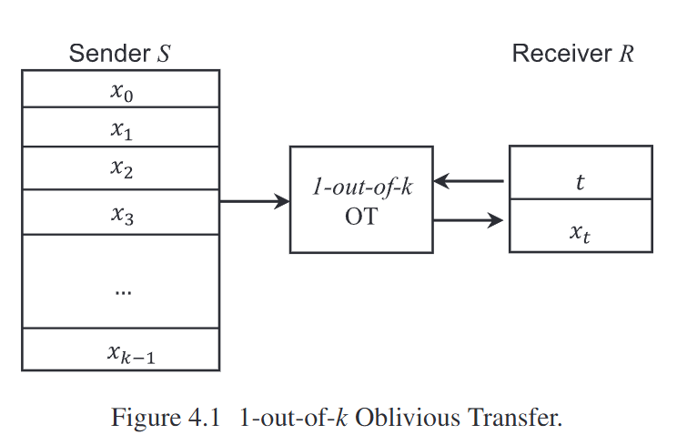

#

## Parameters

- Two participants: Sender $S$ and receiver $R$.
- Sender with two private messages: $x_{1}$, $x_{2}$.
- Receiver with private selection bit $b \in \set{0, 1}$

## Protocol

- The receiver generates a public-private key pair using cryptography tools such as RSA. Noted as $(pk, sk)$, it generates a random public key $rk$, but the receiver does not own the corresponding private key.

- The receiver reorders the keys according to the bit $b \in \set{0, 1}$. For example, if $b = 0$, it generates $(pk, rk)$. If $b = 0$, it generates (rk, pk). The receiver sends the keys to sender $S$.

- The sender encrypts the messages with the key in the same position. For example, if the received keys are $(k_{0}, k_{1})$, the sender encrypts $x_{0}$ with key $k_{0}$ and encrypts $x_{1}$ with key $k_{1}$. Note that the keys are denoted as $(k_{0}, k_{1})$ because the sender $S$ cannot distinguish two keys. After encryption, sender $S$ sends encrypted messages to the receiver $R$.
  

- The receiver $R$ decrypts the messages with private key sk. The receiver can decrypt only one ciphertext successfully since it only holds one of the private keys. The other ciphertext, after decryption, will be random garbage. The decrypted message is $x_{b}$, which is the desired message of the receiver.

  The preceding Oblivious Transfer protocol relies on the security of public key cryptography, in which the private key cannot be calculated from the public key in polynomial time. If we assume that the participants are honest, the protocol is secure because the sender $S$ only knows two public keys from the sender but does not know which private key the receiver holds. The probability that the sender $S$ successfully guesses $b$ of the receiver is no greater than 1/2. The receiver only has one private key, meaning it can decrypt only one of the messages successfully. Decrypting the other message is as difficult as calculating the private key with the public key.
